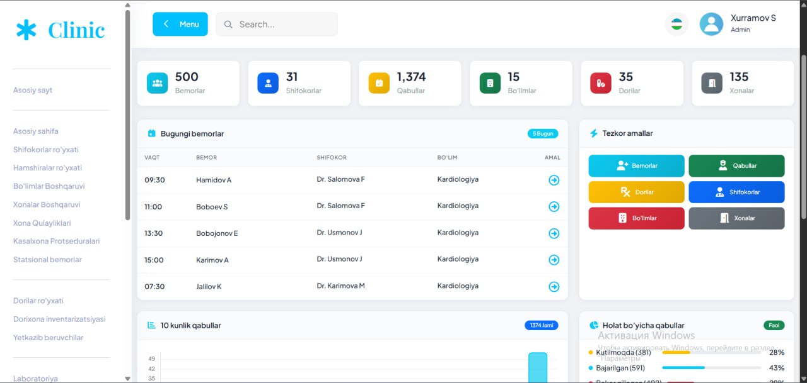
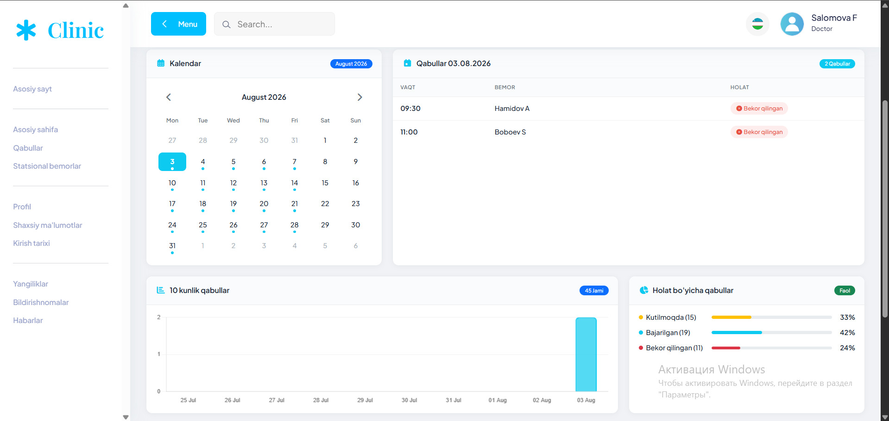
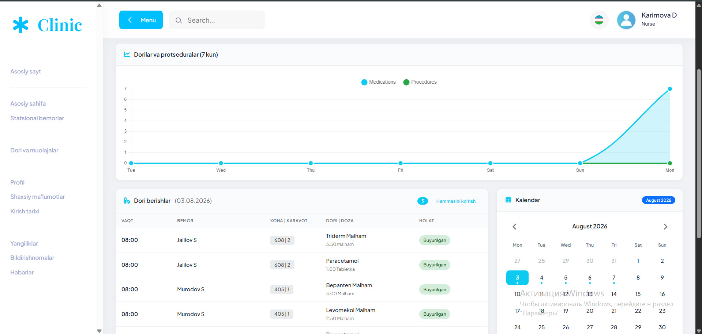
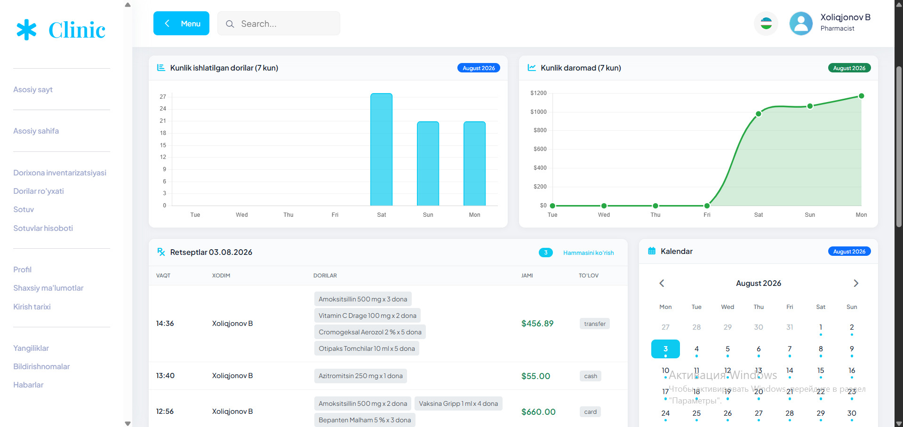
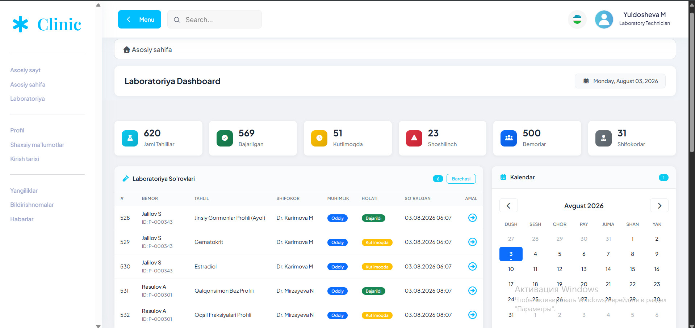
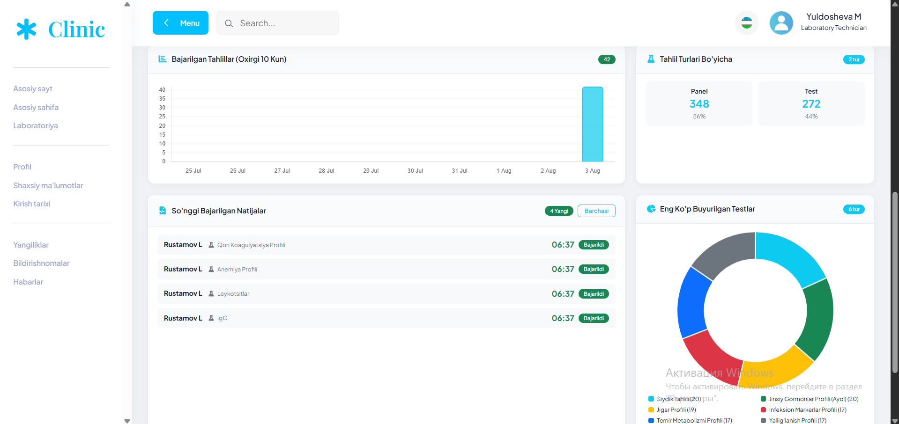
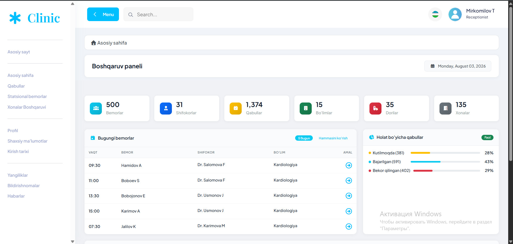

# Hospital Management System


## About the Project

**Hospital Management System** is a modern hospital management system built on the Laravel framework. The system is designed to digitize and manage all major hospital processes.

### Key Objectives:
- Centralized management of patients and staff information
- Automation of appointment processes
- Tracking laboratory results
- Maintaining medicine inventory
- Generating statistics and reports

---

## Key Features

| Module | Description |
|--------|-------------|
| **Patients** | Patient registration, medical history, doctor assignment |
| **Doctors** | Doctor schedules, specializations, working hours |
| **Nurses** | Nurse list, department assignments |
| **Appointments** | Patient check-in, queue management, scheduling |
| **Pharmacists** | Medicine inventory, dispensed medication list |
| **Laboratory** | Test results, lab staff management |
| **Reports** | Daily, monthly, annual statistical reports |
| **Notifications** | Sending notifications to users |
| **Settings** | System settings, user permissions |

# Screenshots















## Technologies

### Backend
- **PHP 8.2+** - Core programming language
- **Laravel 11.x** - Framework
- **MySQL** - Database
- **Laravel Sanctum** - Authentication
- **Laravel Cache** - Caching

### Frontend
- **Blade** - Template engine
- **Bootstrap 5** - CSS framework
- **jQuery** - JavaScript library
- **Bootstrap Icons** - Icons

### Additional Tools
- **Git** - Version control
- **Composer** - PHP package manager
- **NPM** - Frontend package manager

---

## Installation

### Requirements
- PHP 8.2 or higher
- MySQL 8.0 or higher
- Composer
- Node.js & NPM
- Git

### 1. Clone the Project
```bash
git clone https://github.com/shohjaxon97/hospital-management.git
cd hospital-management